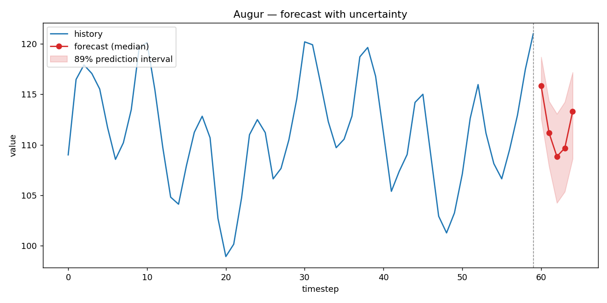

# Augur 🔮

**Uncertainty-aware financial time-series forecasting with a production MLOps pipeline.**

Most "predict the stock price" projects output a single number and quietly overfit. A single number is useless for a real financial decision — you need to know *how confident the model is*. **Augur forecasts a calibrated prediction interval, not a point**, and ships the full production lifecycle around the model: train → evaluate → export → serve.

Built for **HackNomics 2026** — tracks: *FinTech & Digital Economy*, *AI & Automation*, *Best Use of Economic Data*.



---

## Why this is different

| Most student projects | Augur |
|---|---|
| Predict one number | Predicts **calibrated quantile intervals** (how uncertain it is) |
| "Beats the market" hype | **Honest baseline comparison** + interval coverage check |
| A notebook | A **CLI + REST API + ONNX export + Docker** — the production lifecycle |
| Untested | **10 behavioural tests** (beats-baseline, ONNX parity, live API) |

## Results (out-of-the-box synthetic indicator)

A GRU quantile-forecaster vs a naive last-value baseline, on a held-out, time-ordered test segment:

| Metric | Value | Meaning |
|---|---|---|
| **Skill vs naive** | **+72.9%** | 72.9% lower MAE than predicting "last value" |
| MAE (model / naive) | 1.71 / 6.33 | point-forecast error |
| **Interval coverage** | **87.4%** | of actuals fall in the 90% predicted band — well-calibrated |
| PyTorch ↔ ONNX parity | < 1e-6 | exported model is numerically identical |

> **Honest note:** real markets are close to a random walk and are *much* harder to beat than this structured indicator — that's the point of the baseline + coverage checks. Augur is a forecasting *engine* you point at any series, not a get-rich oracle. That honesty is deliberate.

---

## Quickstart

```bash
pip install -e .

augur gen-data --rows 1200          # synthesize a learnable indicator series
augur train --data data/series.csv  # train (seeded, reproducible) + auto-evaluate
augur evaluate                       # skill vs naive + interval coverage
augur forecast                       # next-horizon forecast with intervals
augur plot                           # render docs-quality forecast PNG
augur export-onnx                    # export + verify PyTorch<->ONNX parity
augur serve                          # FastAPI service at http://127.0.0.1:8000/docs
```

Point it at **your own** CSV instead:

```bash
augur train --data my_prices.csv --value-col close --date-col Date
```

Query the running API:

```bash
curl -X POST http://127.0.0.1:8000/forecast \
  -H "Content-Type: application/json" \
  -d '{"history": [/* >= lookback recent values */]}'
```

---

## Architecture

```
            data.py              model.py + train.py            evaluate.py
   CSV / synthetic series  -->  GRU encoder -> quantile head  -->  skill vs naive
        (windowing)              (pinball loss, early stop)        interval coverage
                                          |
                          artifacts/model.pt  (weights + config + scaler)
                                          |
            +-----------------------------+-----------------------------+
            |                             |                             |
        infer.py                     export.py                      api.py
   forecast / plot            ONNX + parity check          FastAPI POST /forecast
   (CLI: forecast, plot)   (CLI: export-onnx)            (CLI: serve | Docker)
```

- **Model** — GRU encoder over a `lookback` window → a head emitting `horizon × quantiles` values, trained with the **pinball (quantile) loss**. Quantiles are sorted at inference so intervals never cross.
- **Reproducibility** — every run is fully determined by `Config` + data; config & scaler are saved with the weights so any model rebuilds from one file.
- **Serving** — exported to **ONNX** for framework-agnostic, low-latency inference, and exposed over **FastAPI**.

## Tech stack

`PyTorch` · `ONNX / ONNX Runtime` · `FastAPI` · `Pydantic` · `Typer` · `pandas` / `numpy` · `pytest` · `Docker`

Chosen to mirror what 2026 ML / SWE postings actually ask for: a PyTorch model taken all the way through the MLOps lifecycle (reproducible training, evaluation, ONNX latency optimization, REST serving, containerization), not just a notebook.

## Project layout

```
augur/
  config.py     reproducible run configuration (dataclass <-> JSON)
  data.py       synthetic generator, CSV loader, windowing, scaler
  model.py      QuantileForecaster (GRU) + pinball loss
  train.py      seeded training loop with early stopping
  evaluate.py   skill-vs-naive + interval coverage
  infer.py      shared forecasting helpers
  export.py     ONNX export + PyTorch/ONNX parity check
  viz.py        forecast + prediction-band plot
  api.py        FastAPI service
  cli.py        Typer CLI (the whole lifecycle)
tests/          10 behavioural tests
```

## Testing

```bash
pytest            # 10 tests: windowing, model shapes, beats-naive, ONNX parity, live API
```

## License

MIT © Amr Alomari
